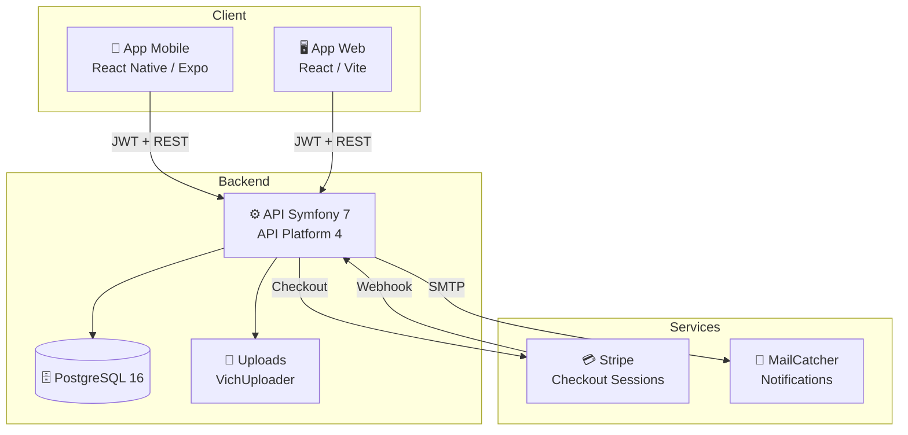
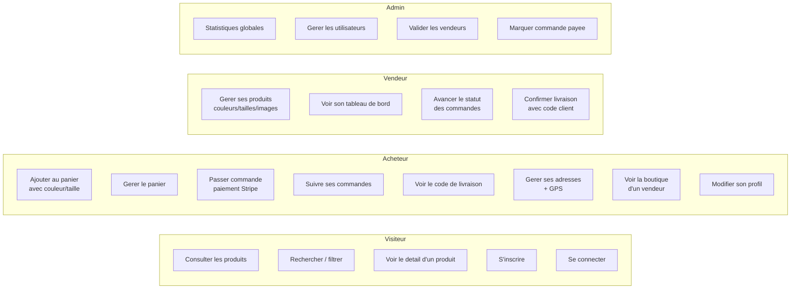
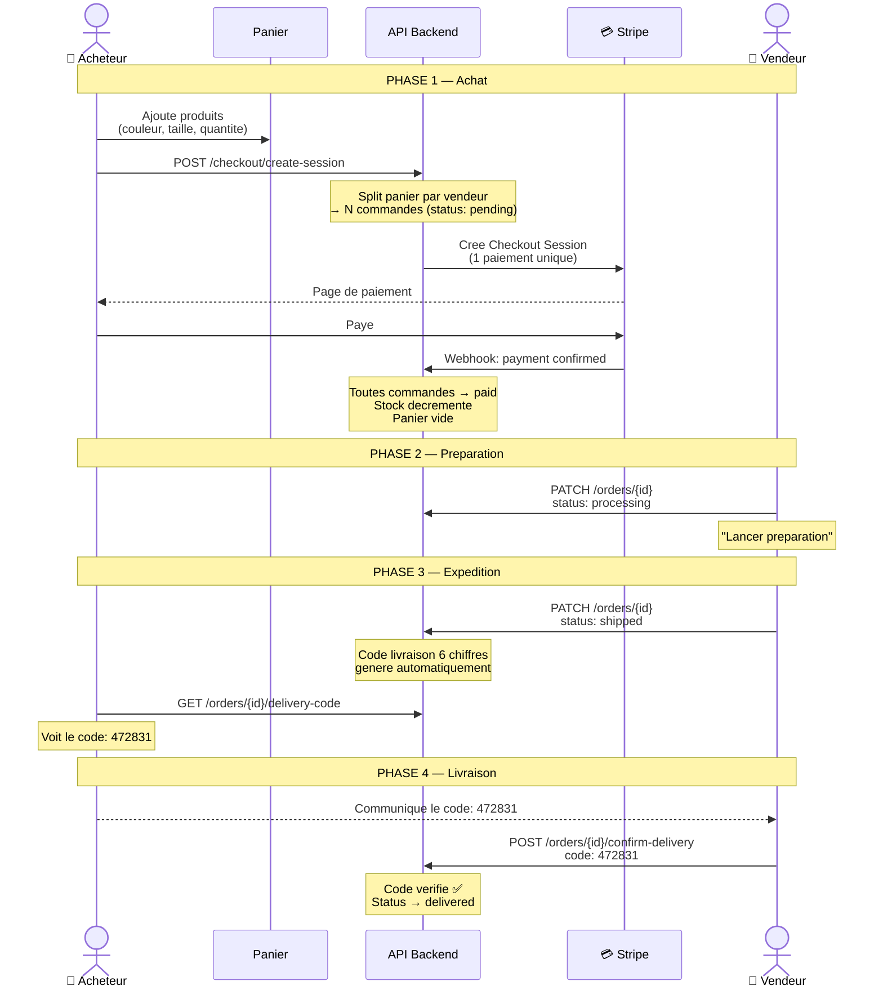
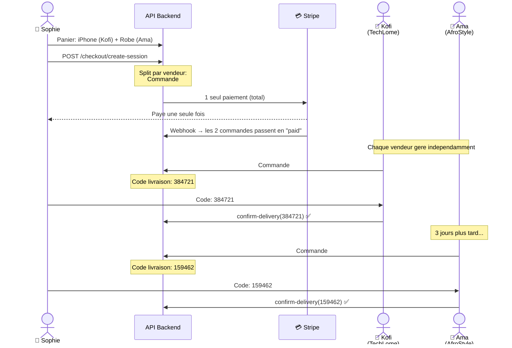
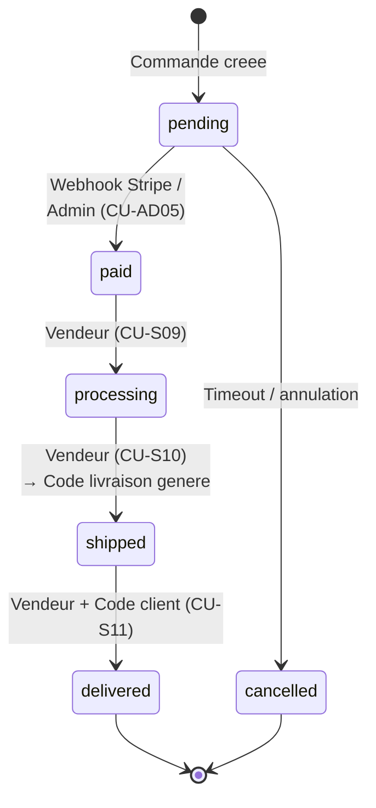
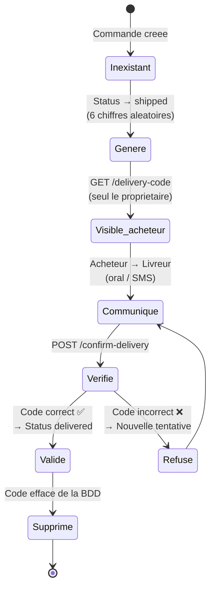

# Cas d'utilisation — TogoMarket

---

## 1. Diagramme d'architecture

---

## 2. Diagramme des cas d'utilisation global

---

## 3. Cas d'utilisation par acteur

### 3.1 Visiteur (non connecte)

| # | Cas d'utilisation | Description | Preconditions | Postconditions |
|---|-------------------|-------------|---------------|----------------|
| CU-V01 | Consulter la page d'accueil | Le visiteur accede a la page d'accueil avec les categories, produits recents et recherche | Aucune | Page affichee |
| CU-V02 | Rechercher un produit | Le visiteur saisit un mot-cle dans la barre de recherche | Aucune | Liste filtree affichee |
| CU-V03 | Voir le detail d'un produit | Le visiteur clique sur un produit pour voir : galerie, prix, couleurs, tailles, vendeur, avis | Produit existant | Page detail affichee |
| CU-V04 | S'inscrire | Le visiteur cree un compte avec prenom, nom, email, mot de passe | Aucune | Compte ROLE_BUYER cree, connexion auto |
| CU-V05 | Se connecter | Le visiteur se connecte avec email et mot de passe | Compte existant et actif | Token JWT, acces a l'app |

---

### 3.2 Acheteur (ROLE_BUYER)

| # | Cas d'utilisation | Description | Preconditions | Postconditions |
|---|-------------------|-------------|---------------|----------------|
| CU-A01 | Selectionner les variantes | L'acheteur choisit la couleur (dot colore) et la taille (chip) sur la page detail | Produit avec variantes | Variantes selectionnees |
| CU-A02 | Ajouter au panier | L'acheteur ajoute un produit avec quantite, couleur et taille | Connecte, variantes selectionnees (si dispo), stock suffisant | Article ajoute au panier |
| CU-A03 | Gerer le panier | L'acheteur modifie les quantites ou supprime des articles | Panier non vide | Panier mis a jour |
| CU-A04 | Gerer ses adresses | L'acheteur ajoute/modifie/supprime des adresses de livraison | Connecte | Adresse sauvegardee |
| CU-A05 | Utiliser la geolocalisation | L'acheteur clique sur le bouton GPS pour remplir automatiquement rue, ville, pays | Permission localisation | Champs remplis automatiquement |
| CU-A06 | Passer commande | L'acheteur selectionne une adresse et paye via Stripe | Panier non vide, adresse existante | Commande(s) creee(s), panier vide |
| CU-A07 | Consulter ses commandes | L'acheteur voit la liste de ses commandes avec statut | Connecte | Liste affichee |
| CU-A08 | Voir le detail d'une commande | L'acheteur voit la timeline, les articles, l'adresse et le total | Commande existante | Detail affiche |
| CU-A09 | Voir le code de livraison | Quand sa commande est expediee, l'acheteur voit le code a 6 chiffres | Commande en statut "shipped" | Code affiche |
| CU-A10 | Communiquer le code au livreur | L'acheteur donne le code au livreur/vendeur pour confirmer la reception | Code visible | Livraison confirmable |
| CU-A11 | Voir la boutique d'un vendeur | L'acheteur clique sur le vendeur dans la page detail pour voir tous ses produits | Page detail produit | Page boutique affichee |
| CU-A12 | Modifier son profil | L'acheteur modifie prenom, nom, telephone | Connecte | Profil mis a jour |

---

### 3.3 Vendeur (ROLE_SELLER)

| # | Cas d'utilisation | Description | Preconditions | Postconditions |
|---|-------------------|-------------|---------------|----------------|
| CU-S01 | Voir le tableau de bord | Le vendeur consulte ses stats : produits, commandes, revenus | Connecte vendeur | Dashboard affiche |
| CU-S02 | Creer un produit | Le vendeur remplit : titre, description, prix (FCFA), stock, categorie, couleurs, tailles, images | Connecte vendeur | Produit cree, slug auto-genere |
| CU-S03 | Modifier un produit | Le vendeur modifie un de ses produits | Proprietaire du produit | Produit mis a jour |
| CU-S04 | Supprimer un produit | Le vendeur supprime un produit apres confirmation | Proprietaire du produit | Produit et images supprimes |
| CU-S05 | Uploader des images | Le vendeur ajoute des photos depuis la galerie ou la camera | Proprietaire du produit | Images uploadees |
| CU-S06 | Gerer les couleurs | Le vendeur selectionne les couleurs disponibles parmi 12 predefinies | Creation/edition produit | Couleurs enregistrees |
| CU-S07 | Gerer les tailles | Le vendeur selectionne les tailles disponibles (vetements ou chaussures) | Creation/edition produit | Tailles enregistrees |
| CU-S08 | Voir ses commandes | Le vendeur consulte les commandes contenant ses produits | Connecte vendeur | Liste filtree par seller |
| CU-S09 | Lancer la preparation | Le vendeur passe une commande payee en "En preparation" | Commande en statut "paid" | Statut → processing |
| CU-S10 | Marquer comme expediee | Le vendeur passe en "Expediee" | Statut "processing" | Statut → shipped, **code livraison genere** |
| CU-S11 | Confirmer la livraison | Le vendeur saisit le code a 6 chiffres donne par le client | Statut "shipped" | Si code correct → statut "delivered" |

---

### 3.4 Administrateur (ROLE_ADMIN)

| # | Cas d'utilisation | Description | Preconditions | Postconditions |
|---|-------------------|-------------|---------------|----------------|
| CU-AD01 | Voir les statistiques | L'admin consulte les stats globales : utilisateurs, produits, commandes, revenus | Connecte admin | Dashboard affiche |
| CU-AD02 | Gerer les utilisateurs | L'admin active/desactive des comptes | Connecte admin | Compte modifie |
| CU-AD03 | Valider un vendeur | L'admin approuve ou refuse un profil vendeur | Profil en attente | Statut mis a jour |
| CU-AD04 | Gerer les categories | L'admin cree/modifie/supprime des categories | Connecte admin | Categorie modifiee |
| CU-AD05 | Marquer commande payee | L'admin passe une commande "pending" en "paid" (paiement hors ligne) | Commande en attente | Statut → paid |

---

## 4. Flux de commande (processus complet)

---

## 5. Flux de commande multi-vendeurs

---

## 6. Scenarios detailles

### CU-V04 : S'inscrire

| Element | Detail |
|---------|--------|
| **Acteur** | Visiteur |
| **Precondition** | Aucune |
| **Scenario principal** | 1. Le visiteur clique sur "Creer un compte" 2. Il remplit : prenom, nom, email, mot de passe 3. Le systeme verifie l'unicite de l'email 4. Le compte est cree avec ROLE_BUYER 5. Le systeme connecte automatiquement l'utilisateur 6. Redirection vers l'accueil |
| **Scenario alternatif** | 3a. L'email existe deja → message d'erreur |
| **Postcondition** | Compte cree, utilisateur connecte |

### CU-A02 : Ajouter au panier

| Element | Detail |
|---------|--------|
| **Acteur** | Acheteur |
| **Precondition** | Connecte, page detail produit |
| **Scenario principal** | 1. L'acheteur selectionne une couleur (si disponible) 2. Il selectionne une taille (si disponible) 3. Il choisit la quantite 4. Il clique sur "Ajouter" 5. Le systeme verifie le stock 6. L'article est ajoute au panier avec les variantes |
| **Scenario alternatif** | 1a. Couleur requise mais non selectionnee → alerte "Veuillez choisir une couleur" 2a. Taille requise mais non selectionnee → alerte "Veuillez choisir une taille" 5a. Stock insuffisant → erreur "Stock insuffisant" 6a. Meme produit+couleur+taille deja dans le panier → quantites fusionnees |
| **Postcondition** | Article dans le panier |

### CU-A06 : Passer commande (multi-vendeurs)

| Element | Detail |
|---------|--------|
| **Acteur** | Acheteur |
| **Precondition** | Panier non vide, au moins une adresse |
| **Scenario principal** | 1. L'acheteur va au checkout 2. Il selectionne une adresse de livraison 3. Il clique sur "Payer" 4. Le systeme groupe les articles par vendeur 5. 1 commande par vendeur est creee (status: pending) 6. 1 session Stripe est creee avec le total 7. L'acheteur est redirige vers la page Stripe 8. Apres paiement, le webhook met toutes les commandes en "paid" 9. Le stock est decremente, le panier vide |
| **Scenario alternatif** | 5a. Stock insuffisant pour un produit → erreur avec nom du produit |
| **Postcondition** | N commandes creees, panier vide |

### CU-S11 : Confirmer la livraison avec code

| Element | Detail |
|---------|--------|
| **Acteur** | Vendeur |
| **Precondition** | Commande en statut "shipped" |
| **Scenario principal** | 1. Le vendeur clique sur "Confirmer livraison" 2. Un modal s'ouvre avec un champ de saisie 6 chiffres 3. Le vendeur demande le code au client 4. Il saisit le code et clique "Confirmer" 5. Le systeme verifie le code cote serveur 6. Si correct : commande → "delivered", code efface |
| **Scenario alternatif** | 5a. Code incorrect → erreur "Code de livraison incorrect" 4a. Code incomplet (moins de 6 chiffres) → bouton desactive |
| **Postcondition** | Commande livree, code supprime |

### CU-AD05 : Marquer commande payee (admin)

| Element | Detail |
|---------|--------|
| **Acteur** | Administrateur |
| **Precondition** | Connecte admin, commande en statut "pending" |
| **Scenario principal** | 1. L'admin voit une commande en attente de paiement 2. Il clique sur "Marquer payee" 3. Confirmation demandee 4. Le statut passe a "paid" |
| **Cas d'usage** | Paiement en especes, virement bancaire, mobile money — le paiement est confirme hors Stripe |
| **Postcondition** | Commande payee, vendeur peut commencer la preparation |

---

## 7. Diagramme d'etats — Commande

---

## 8. Diagramme d'etats — Code de livraison

